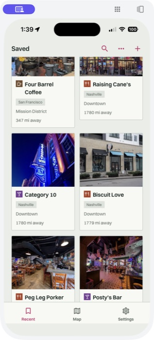

# Sponsor roles, category coherence, and venue-kind repair

## Diagnosis and implementation

The [pre-change table](VENUE_CLASSIFICATION_DIAGNOSIS.md) covers all 15 production
places. H1 is supported: stale whole-reel bar inference persisted after linking
the Nashville venues. H2 is not supported by the stored arrays. The repair
does not infer missing historical provider data.

Precedence is now user override → resolved primaryType → own segment → reel
fallback. The provenance is stored in candidate.venue_kind_derivation; the
legacy provider/user field remains backward compatible. An absent primaryType
is no longer fabricated from the first types[] member. Array fallback ranks
food before bars, specific food types before generic restaurant, then uses the
explicit registry ordering, independent of array order. Unknown types are
logged even when a lower-priority inference supplies the display kind.

SponsorCandidate and VenueCandidate are distinct frozen types. VenueInputs
rejects mixed types and sponsor/venue identity overlap. Detection uses selected
post partnership containers, disclosure tags/phrases, and commercial intent
near handles. Identity normalization handles punctuation, spaces, and underscores.
Sponsors are saved in raw_signals.sponsor_candidates, excluded from extraction
and resolution, and never reinstated merely because they have an address.
Uncorroborated handles cap at 0.4 and cannot acquire an automatic pin.

Partnership adapters read selected-post JSON and oEmbed fields when exposed;
they do not claim every public endpoint exposes these fields. Disclosed embed
posts get one bounded HTML metadata attempt. Extraction/fetch versions change
so old unsafe results are not silently replayed. Compilation segments retain
their own evidence and the shared sponsor exclusions.

Category coherence is a hard veto before ranking, including cached places and
platform POIs. All rejected Google candidates are recorded with name, type,
context, and hypothetical name score. Surviving candidates are ranked normally;
exhausted fan-out returns category_mismatch for review. Unknown types pass the
gate with type_match=0, not a guessed match.

## Fixture results

- 12 explicitly synthetic sponsored-reel cases: six physical-location brands,
  six venue-plus-sponsor cases. Zero sponsor entries; all six dual cases retain
  the venue. The reported Toast caption is represented directly.
- 10 explicitly synthetic food/non-food homonym cases: each exact-name wrong
  category is vetoed; the surviving food candidate wins. These are unit
  fixtures, not a claim of testing 22 additional live videos.
- Tests also cover selected-post metadata isolation, typed-list rejection,
  handle confidence, YAML-only new contexts, cached poison, exhausted fan-out,
  user overrides, backfill preservation/idempotence, and provider precedence.
- Full regression run: 123 backend tests and 42 app tests passed, including
  existing Sturtevant Falls, BCD Tofu House, personal ownership and offline queue
  coverage. TypeScript and Python compilation checks passed.
- The added native configuration test ensures resolver-only registry sections
  never become bundled content types in a future app build.

| Sponsored fixture | Sponsor excluded | Venue retained |
| --- | --- | --- |
| Reported Toast caption | Toast | None; review |
| Physical coffee brand | Starbucks | None |
| Physical clothing brand | Uniqlo | None |
| Physical retail brand (OCR) | Target | None |
| Physical restaurant brand (transcript) | Chipotle | None |
| Physical hotel brand (metadata) | Marriott | None |
| Dual coffee | Airbnb | Four Barrel Coffee |
| Dual grill | Toast | Madison Bar and Grill |
| Dual sandwich | Nike | Cappone's |
| Dual diner | Samsung | Golden Diner |
| Dual overlay | Booking | BCD Tofu House |
| Dual metadata | REI | Sturtevant Falls Trail |

All 12 passed. Each of the following 10 synthetic exact-name candidates has
name score 1.0, is vetoed before scoring, and yields to the compatible candidate:

| Name | Rejected primaryType | Winning primaryType |
| --- | --- | --- |
| Toast | clothing_store | breakfast_restaurant |
| Apple | electronics_store | cafe |
| Chase | bank | restaurant |
| Lotus | car_dealer | thai_restaurant |
| Rose | pharmacy | bakery |
| Sole | shoe_store | seafood_restaurant |
| Craft | hardware_store | brewery |
| Room | furniture_store | coffee_shop |
| Gem | jewelry_store | deli |
| State | insurance_agency | diner |

## Registry as shipped

The complete type-to-kind mapping and compatibility YAML are in
[config/content_types.yaml](../config/content_types.yaml). Audited mapping sizes:

| Kind | Explicit Google types |
| --- | ---: |
| restaurant | 132 |
| cafe | 8 |
| bar | 5 |
| nightclub | 1 |
| bakery | 5 |
| dessert | 10 |
| hotel | 16 |
| shop | 38 |
| culture | 13 |
| attraction | 9 |
| outdoors | 18 |
| beach | 3 |
| fitness | 12 |
| wellness | 12 |
| entertainment | 26 |
| other | 0 (explicit fallback) |

Added/corrected restaurant mappings include sandwich_shop, noodle_shop,
salad_shop, steak_house, bar_and_grill, brewpub and gastropub; pastry_shop is
bakery. All requested restaurant subtypes have regression assertions.
Under the requested strict bar rule, bar includes only bar, pub, wine_bar,
brewery and night_club. Other granular bar/provider types without an explicit
mapping now fall to other and are logged, with segment/reel fallback where
available. No such type was encountered among the 15 original entries.

```yaml
category_compatibility:
  food_context:
    signals: [restaurant, cafe, bar, bakery, dessert, nightclub]
    keywords: [food, foodreview, restaurant, cafe, coffee, brunch, dinner, lunch, breakfast, noodles, burger, pancakes]
    accepts: ['*_restaurant', restaurant, cafe, coffee_shop, coffee_roastery, bar, pub, bakery, food, meal_takeaway, meal_delivery, ice_cream_shop, night_club, brewery, wine_bar, deli, diner, sandwich_shop, steak_house, noodle_shop, salad_shop, bar_and_grill, brewpub, gastropub]
    rejects: [clothing_store, womens_clothing_store, electronics_store, bank, car_dealer, pharmacy, shoe_store, auto_parts_store, hardware_store, furniture_store, jewelry_store, insurance_agency, real_estate_agency]
  outdoors_context:
    signals: [outdoors, beach, attraction]
    keywords: [hiking, hike, waterfall, trail, beach]
    accepts: [park, hiking_area, natural_feature, tourist_attraction, beach, national_park, state_park, botanical_garden, wildlife_park, wildlife_refuge]
    rejects: [clothing_store, electronics_store, bank, car_dealer, pharmacy, insurance_agency, real_estate_agency]
```

Google documents primaryType as the single primary classification and provides
granular restaurant types in its [Places type reference](https://developers.google.com/maps/documentation/places/web-service/place-types).
TikTok documents the [paid-partnership disclosure](https://developers.tiktok.com/docs/en/content-sharing-guidelines);
public metadata visibility is narrower than disclosure support.

## Production verification

Both Render services are Live on `1ed818c3d0163d5ab49c85c2b20a469f494ed63d`:

- [API deployment](https://dashboard.render.com/web/srv-d92r8qtaeets73ahm62g/deploys/dep-dak5f0id0e5s73a0d1a0)
- [Worker deployment](https://dashboard.render.com/worker/srv-d92r8qtaeets73ahm620/deploys/dep-dak5f0id0e5s73a0d0u0)

Pre-deployment checks and API health passed. The final readiness response reports
database healthy, R2 healthy, queue healthy, and queue depth zero.

### Original library repair

The rollback-only preview checked all 15 original entries, followed by an
identical committed repair. **Five kinds changed; zero category mismatches or
sponsor-derived entries were flagged. No original entries or pins were deleted.**

| Entry | Before | After |
| --- | --- | --- |
| Raising Cane's | bar | restaurant |
| Biscuit Love | bar | restaurant |
| Peg Leg Porker | bar | restaurant |
| Hattie B's | bar | restaurant |
| Play Playground | bar | attraction |

Category 10 and Posty's Bar remain bar; Four Barrel Coffee remains cafe;
BCD Tofu House remains restaurant; Sturtevant Falls Trail remains outdoors.
All ten other original kinds are unchanged. The original library remains 15
entries. No Toast entry existed in this library at repair time: its earlier
bad match belonged to the already-removed acceptance-test library, not the owner.

The network-free repair follows the short-transaction Postgres guidance, with
lock/statement timeouts, preservation assertions, and per-save recovery journals.
IDs, owners, notes and custom folders were preserved. Production contained zero
user overrides; preservation of overrides is separately exercised by unit tests.
No new unmapped provider type was encountered. Missing primaryType is explicitly
recorded as `<missing>` and uses the documented fallback, not a fabricated type.

A second rollback-only run reported zero kind changes and zero flags. It checked
18 rows at that moment: the original 15 plus three isolated entries left by the
interrupted first regression attempt (cleanup status below).

### Live regressions

| Reel | Result | Exact address |
| --- | --- | --- |
| Four Barrel Coffee | resolved, cafe | 375 Valencia St, San Francisco, CA 94103, USA |
| Madison Bar and Grill | resolved, restaurant | 1316 Washington St, Hoboken, NJ 07030, USA |
| Cappone's | resolved, restaurant | 11 Abingdon Square, New York, NY 10014, USA |
| Golden Diner | resolved, restaurant | 123 Madison St, New York, NY 10002, USA |
| @tastebywill / Toast | needs_review, no pin | None |

All five passed. Four Barrel additionally identified Airbnb as a sponsor without
losing the café. Original addresses and linked place IDs were unchanged.

The reported [Toast reel](https://www.tiktok.com/@tastebywill/video/7639109279198252318)
was also repeated once to collect its exact signal diagnostics:

- Caption: “Busy tables for the Big Chicken Bun with @Toast  Power ranking of
  dishes: 1. Big Chicken Bun 2. Sloppy Bao 3. Sesame Noodles 4. Scallion Pancakes
  #ToastPartner #ad #brooklyn #nyc #foodreview”.
- OCR/transcript: empty; no platform paid-partnership metadata was exposed in
  this fetch. Caption disclosure supplied the sponsor evidence.
- Sponsor candidates: `Toast`, source `caption_brand_partner`, evidence
  `#ToastPartner`, confidence `0.98`.
- Venue candidates: `[]`.
- Entry: `Unidentified place`, no linked place/address/pin, review reasons
  `sponsor_not_venue;unresolved_place;low_confidence`.
- Geocoding candidates: `[]`; scores/veto statuses: not applicable. The sponsor
  gate stopped resolution before a Google query. No restaurant alternative or
  clothing-store score is invented for this run. The independent homonym tests
  above exercise the category veto and survivor re-ranking.
- Diagnostic replay job: `e0ecc62a-0c15-45cf-ad7b-be5f89d9a187` (test account
  subsequently deleted by its authenticated cleanup).

The first regression attempt passed Four Barrel and Madison, then encountered
a transient read/TLS timeout during Cappone's and its cleanup. The complete
retry passed all five; its isolated account was deleted successfully, as was
the additional Toast diagnostic replay. The helper now retries idempotent
reads/cleanup on transient failures, without automatically retrying POST writes.

**Remaining cleanup requiring dashboard deletion confirmation:** the interrupted
first run's isolated user `97ffdd33-9a31-4fac-a46d-760d39fdb3fe` still owns three
test entries. They are not in the owner's library. This is a test-cleanup item,
not a failed sponsor/venue regression. No original personal data should be
included in that deletion.

### Physical iPhone verification

On the installed iPhone 15 Pro build 30, reopening ReelBot synchronized the
server-side correction without an app reinstall. Recent shows restaurant icons
for Raising Cane's, Biscuit Love and Peg Leg Porker, bar icons for Category 10
and Posty's Bar, and the café icon for Four Barrel. The map shows eight anchored
restaurants and the corrected restaurant-majority Nashville cluster. Its list
also retains BCD Tofu House, Sturtevant Falls and Four Barrel with their expected
icons. Derived kind-folder and map projections use the same corrected values;
their consistency is covered in the app suite.


